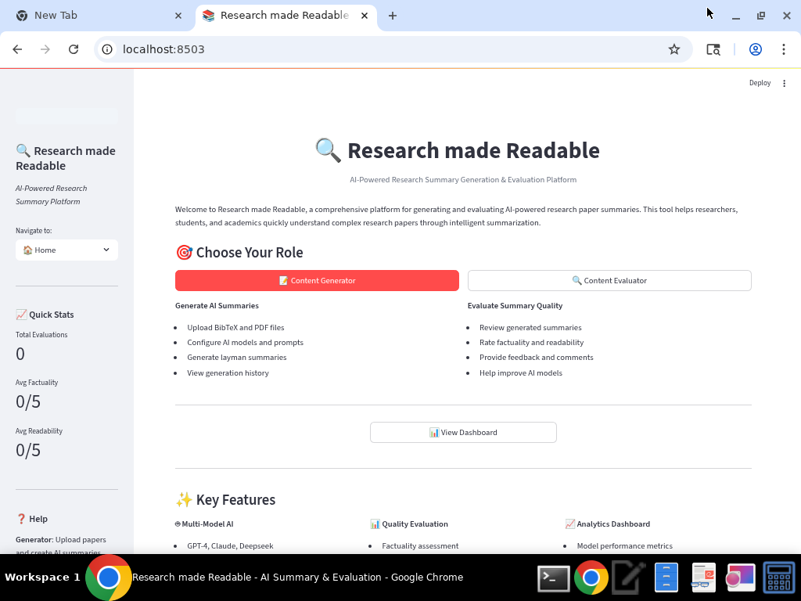
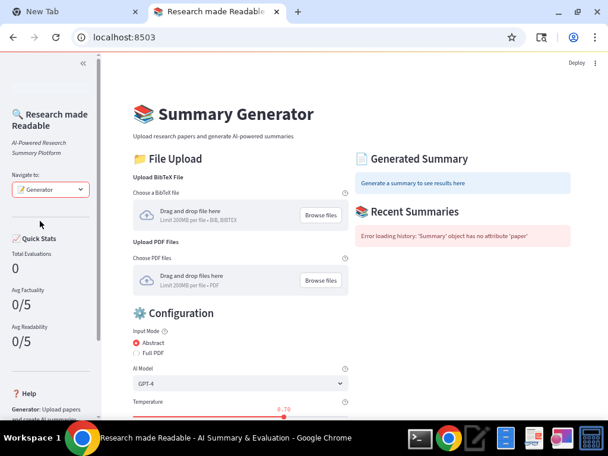
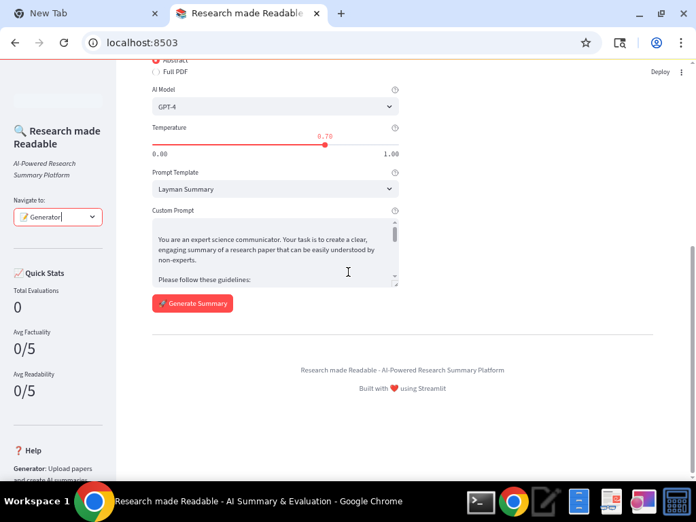
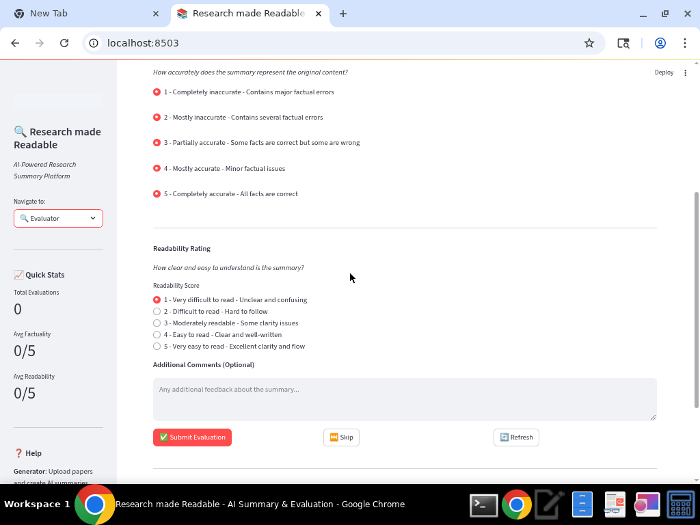
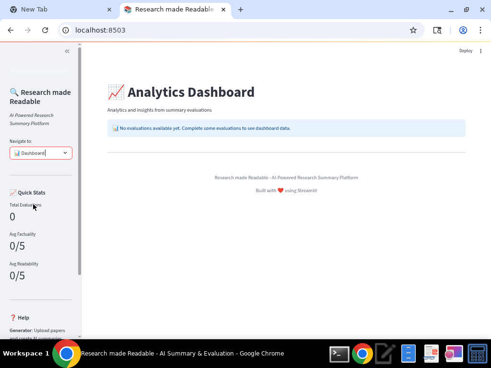

# Research made Readable - AI-Powered Research Summary Platform

A comprehensive Streamlit application for generating and evaluating AI-powered research paper summaries.

## Features

### 🤖 Multi-Model AI Integration
- **GPT-4** and **GPT-4-Mini** from OpenAI
- **Claude-3-Sonnet** and **Claude-3-Haiku** from Anthropic
- **Deepseek-Chat** model
- **Llama-3-8B** and **Mistral-7B** open-source models

### 📝 Content Generation
- Upload BibTeX files with paper metadata and abstracts
- Upload PDF files for full-text processing
- Configurable AI models and parameters
- Custom prompt templates (Layman, Technical, Executive, Educational)
- Temperature control for creativity adjustment
- Generation history tracking

### 🔍 Content Evaluation
- Side-by-side comparison of original abstracts and generated summaries
- Factuality rating (1-5 scale)
- Readability rating (1-5 scale)
- Optional evaluator comments
- Random paper selection for unbiased evaluation

### 📊 Analytics Dashboard
- Model performance metrics
- Evaluation statistics and trends
- Data visualization with interactive charts
- CSV data export functionality

## Installation

### Prerequisites
- Python 3.8 or higher
- Internet connection for AI model access

> **Note**: No external database installation required! The application uses DuckDB with Parquet file storage for a completely self-contained setup.

### Quick Setup

1. **Clone or download the application**
```bash
cd /home/ubuntu
git clone <repository-url> research_summary_app
# OR extract from ZIP file
```

2. **Navigate to the project directory**
```bash
cd research_summary_app
```

3. **Run the setup script**
```bash
python setup.py
```

4. **Start the application**
```bash
streamlit run app.py
```

5. **Access the application**
Open your browser and navigate to `http://localhost:8501`

### Manual Installation

If you prefer manual installation:

1. **Install dependencies**
```bash
pip install -r requirements.txt
```

2. **Set up environment variables**
The application uses DuckDB for local data storage and AI model APIs. Database initialization is automatic on first run.

3. **Create required directories**
```bash
mkdir -p data/uploads data/exports data/db logs
```

> **Simplified Setup**: No database server installation or configuration needed! DuckDB and Parquet files are created automatically in the `data/db/` directory.

## Screenshots

The following screenshots showcase the key interfaces and features of the Research made Readable application:

### Home Page - Role Selection


The home page welcomes users with a clean interface featuring the application title "Research made Readable" and role-based navigation. Users can choose between different roles (Content Generator, Content Evaluator) to access specific functionality tailored to their needs.

### Generator Interface - Summary Creation


The Generator interface provides comprehensive tools for creating AI-powered research summaries. Key features include:
- File upload support for BibTeX and PDF files
- AI model selection (GPT-4, Claude, Deepseek, etc.)
- Input mode selection (Abstract or Full PDF processing)
- Configurable parameters including temperature control
- Multiple prompt templates (Layman, Technical, Executive, Educational)
- Custom prompt editing capabilities

### Generator Interface - Configuration Options


The generator interface shows detailed configuration options including:
- AI model dropdown with multiple options (GPT-4, Claude-3-Sonnet, etc.)
- Temperature slider for controlling output creativity (0.00 to 1.00)
- Prompt template selection with predefined options
- Custom prompt text area for personalized instructions
- Generate Summary button to initiate the AI processing

### Evaluator Interface - Quality Assessment


The Evaluator interface enables comprehensive quality assessment of generated summaries:
- Side-by-side comparison of original abstracts and AI-generated summaries
- Factuality rating system (1-5 scale) to assess accuracy
- Readability rating system (1-5 scale) to evaluate clarity and comprehension
- Optional comments section for detailed feedback
- Submit, Skip, and Refresh buttons for efficient evaluation workflow

### Analytics Dashboard - Performance Insights


The Analytics Dashboard provides comprehensive insights into summary generation and evaluation performance:
- Overview of analytics and insights from summary evaluations
- Performance metrics visualization
- Data-driven insights for model comparison
- Export functionality for detailed analysis
- Clean, professional interface for monitoring application usage

## Usage

### For Content Generators

1. **Navigate to the Generator page**
2. **Upload files:**
   - BibTeX files (.bib) containing paper metadata and abstracts
   - PDF files of research papers
3. **Configure generation settings:**
   - Select AI model (GPT-4, Claude, etc.)
   - Choose input mode (Abstract or Full PDF)
   - Select prompt template or write custom prompt
   - Adjust temperature for creativity
4. **Generate summaries** and review results
5. **Save summaries** to the database

### For Content Evaluators

1. **Navigate to the Evaluator page**
2. **Review presented papers:**
   - Original abstract on the left
   - Generated summary on the right
3. **Rate the summary:**
   - Factuality (1-5): How accurate is the summary?
   - Readability (1-5): How clear and understandable is it?
4. **Add optional comments**
5. **Submit evaluation** and continue to next paper

### Dashboard Analytics

1. **Navigate to the Dashboard page**
2. **View performance metrics:**
   - Overall evaluation statistics
   - Model-by-model performance comparison
   - Interactive charts and visualizations
3. **Export data:**
   - Download complete dataset as CSV files
   - Use for external analysis and reporting

## File Structure

```
research_summary_app/
├── app.py                          # Main Streamlit application
├── setup.py                        # Setup script
├── requirements.txt                # Python dependencies
├── README.md                       # Documentation
├── src/
│   ├── ai_models/
│   │   ├── model_interface.py      # AI model integration
│   │   └── prompts.py              # Default prompts
│   ├── database/
│   │   ├── models.py               # DuckDB schema definitions
│   │   └── operations.py           # Database operations
│   ├── parsers/
│   │   ├── bibtex_parser.py        # BibTeX file parser
│   │   └── pdf_parser.py           # PDF text extraction
│   ├── ui_components/
│   │   ├── generator_interface.py  # Generator UI
│   │   ├── evaluator_interface.py  # Evaluator UI
│   │   └── dashboard_interface.py  # Dashboard UI
│   └── utils/
│       ├── session_manager.py      # Session management
│       └── helpers.py              # Utility functions
├── data/
│   ├── db/                         # DuckDB and Parquet files
│   │   ├── research_app.duckdb     # DuckDB database file
│   │   ├── papers.parquet          # Papers data storage
│   │   ├── summaries.parquet       # Summaries data storage
│   │   ├── translations.parquet    # Translations data storage
│   │   └── evaluations.parquet     # Evaluations data storage
│   ├── uploads/                    # Uploaded files
│   └── exports/                    # Exported data
├── tests_and_debug/                # Testing and debugging files
│   ├── README.md                   # Testing documentation
│   ├── test_app.py                 # Interactive BibTeX parser test
│   ├── test_bibtex.bib             # Test BibTeX data
│   ├── debug_bibtex_detailed.py    # Detailed BibTeX debugging
│   ├── debug_standalone.py         # Standalone parser testing
│   ├── debug_validation.py         # Validation step debugging
│   ├── test_bibtex_debug.py        # BibTeX parser unit tests
│   └── test_fixed_parser.py        # Fixed parser implementation tests
└── docs/
    └── deployment.md               # Deployment instructions
```

## Database Architecture

The application uses **DuckDB** with **Parquet file storage** for optimal performance and portability:

### Storage Format
- **DuckDB**: Fast, embedded SQL database for queries and operations
- **Parquet Files**: Columnar storage format for efficient data storage and retrieval
- **Self-contained**: No external database server required

### Data Tables
- **Papers** (`papers.parquet`): Research paper metadata, abstracts, and full text
- **Summaries** (`summaries.parquet`): Generated summaries with model metadata and parameters
- **Translations** (`translations.parquet`): Multi-language translations of summaries
- **Evaluations** (`evaluations.parquet`): Human evaluations of summary quality and readability

### Benefits
- **Portable**: Copy the entire `data/db/` directory to move your data
- **Fast**: DuckDB optimized for analytical workloads
- **No Setup**: Database files created automatically on first run
- **Efficient**: Parquet format provides excellent compression and query performance

## 🚀 Portability & Deployment Advantages

### Complete Self-Containment
- **Zero External Dependencies**: No PostgreSQL server installation required
- **File-Based Storage**: All data stored in portable Parquet files
- **Single Directory Deployment**: Copy the entire application directory to any machine

### Easy Backup & Migration
```bash
# Backup your entire database
cp -r data/db/ backup_$(date +%Y%m%d)/

# Migrate to new server
scp -r research_summary_app/ user@newserver:/path/to/deployment/
```

### Development to Production
- **Identical Architecture**: Development and production use the same storage format
- **No Configuration Changes**: No database connection strings or credentials to manage
- **Instant Setup**: Run `streamlit run app.py` on any machine with Python

## API Integration

The application integrates with multiple AI models through a unified API interface:

- All models use the same endpoint format
- Automatic fallback and error handling
- Configurable parameters (temperature, max tokens)
- Request/response logging for debugging

## Troubleshooting

### Common Issues

1. **Database File Access Issues**
   - Ensure the `data/db/` directory exists and is writable
   - Check file permissions for Parquet files
   - Verify sufficient disk space for database operations

2. **AI Model API Errors**
   - Check API key configuration
   - Verify internet connectivity
   - Review API rate limits

3. **File Upload Issues**
   - Ensure file formats are supported (.bib, .pdf)
   - Check file size limits
   - Verify file permissions

4. **PDF Text Extraction Fails**
   - Try different PDF files
   - Check if PDF is text-based (not scanned images)
   - Verify PDF is not password-protected

5. **Data Migration or Corruption**
   - DuckDB automatically handles data integrity
   - Parquet files can be verified using DuckDB directly
   - Backup/restore is as simple as copying the `data/db/` directory

### Logs and Debugging

- Check browser console for JavaScript errors
- Review Streamlit logs in terminal
- DuckDB operations are logged in application output
- Database files are created automatically if missing

## Testing and Development

### Testing Suite
The application includes a comprehensive testing suite located in the `tests_and_debug/` directory. This directory contains:

- **Interactive test applications** for BibTeX parsing
- **Debug scripts** for troubleshooting parsing issues
- **Unit tests** for parser functionality
- **Test data files** with real research paper examples

### Running Tests
To run the testing suite:

```bash
# Run individual test files
python tests_and_debug/test_app.py
python tests_and_debug/debug_bibtex_detailed.py

# Run interactive BibTeX parser test
streamlit run tests_and_debug/test_app.py

# Run all debug scripts
cd tests_and_debug
for file in debug_*.py test_*.py; do
    echo "Running $file..."
    python "$file"
    echo "---"
done
```

### Test Coverage
The testing suite focuses on:
- **BibTeX parsing** with complex formatting scenarios
- **Edge cases** handling (spaces in keys, special characters, long abstracts)
- **Database operations** with DuckDB and Parquet storage
- **Error handling** and validation processes

For detailed information about each test file and debugging procedure, see the [Testing README](tests_and_debug/README.md).

## Contributing

To contribute to the project:

1. Fork the repository
2. Create a feature branch
3. Make your changes
4. Test thoroughly
5. Submit a pull request

## License

This project is licensed under the MIT License. See LICENSE file for details.

## Support

For support and questions:
- Check the troubleshooting section
- Review the documentation
- Submit issues through the project repository

---

**Research made Readable** - Making research accessible through AI-powered summarization.
