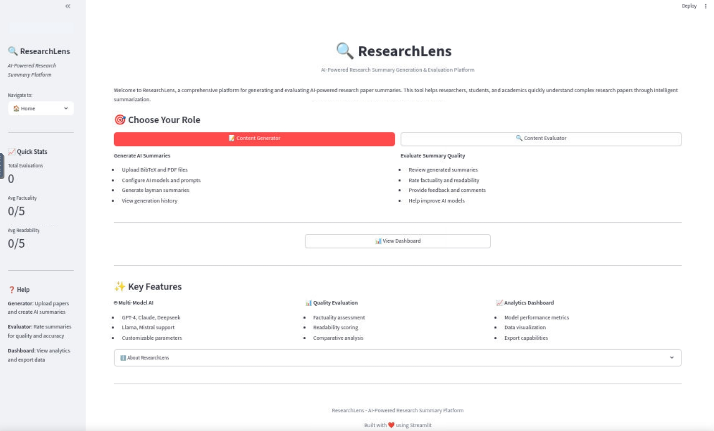
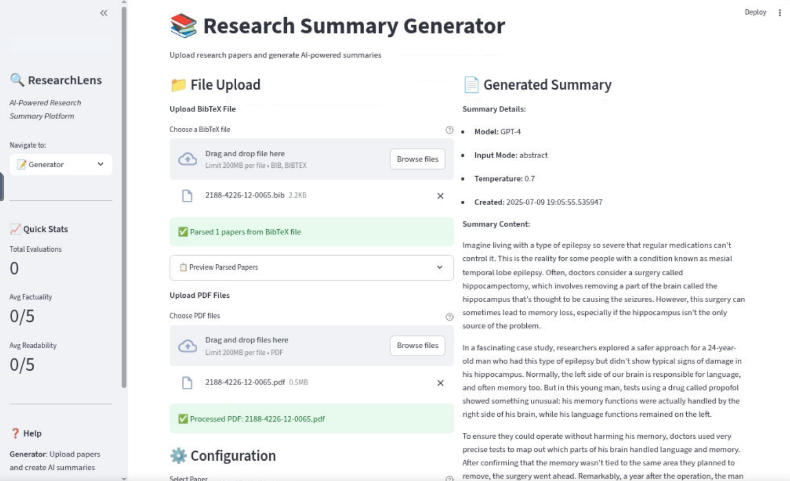
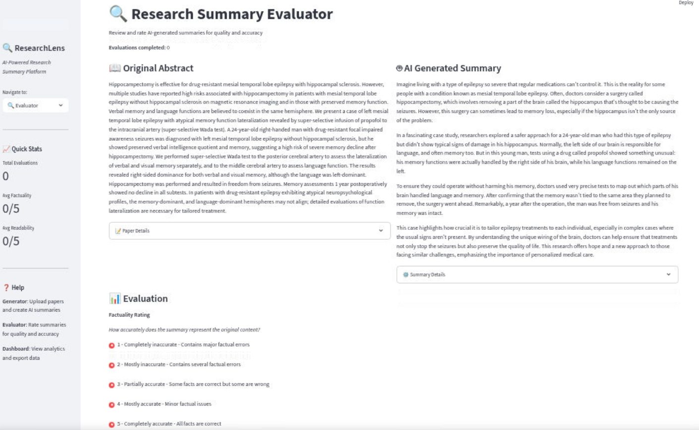

# Research made Readable - AI-Powered Research Summary Platform

A comprehensive Streamlit application for generating and evaluating AI-powered research paper summaries.

## Features

### 🤖 Multi-Model AI Integration
- **GPT-4** and **GPT-4-Mini** from OpenAI
- **Claude-3-Sonnet** and **Claude-3-Haiku** from Anthropic
- **Deepseek-Chat** model
- **Llama-3-8B** and **Mistral-7B** open-source models

### 📝 Content Generation
- Upload BibTeX files with paper metadata and abstracts
- Upload PDF files for full-text processing
- Configurable AI models and parameters
- Custom prompt templates (Layman, Technical, Executive, Educational)
- Temperature control for creativity adjustment
- Generation history tracking

### 🔍 Content Evaluation
- Side-by-side comparison of original abstracts and generated summaries
- Factuality rating (1-5 scale)
- Readability rating (1-5 scale)
- Optional evaluator comments
- Random paper selection for unbiased evaluation

### 📊 Analytics Dashboard
- Model performance metrics
- Evaluation statistics and trends
- Data visualization with interactive charts
- CSV data export functionality

## Installation

For full deployment on a production environment see the [Deployment guide](./docs/deployment.md).

### Prerequisites
- Python 3.8 or higher
- PostgreSQL database (automatically configured)
- Internet connection for AI model access

### Quick Setup

1. **Clone or download the application**
```bash
cd /home/ubuntu
git clone <repository-url> research_summary_app
# OR extract from ZIP file
```

2. **Navigate to the project directory**
```bash
cd research_summary_app
```

3. **Run the setup script**
```bash
python setup.py
```

4. **Start the application**
```bash
streamlit run app.py
```

5. **Access the application**
Open your browser and navigate to `http://localhost:8501`

### Manual Installation

If you prefer manual installation:

1. **Install dependencies**
```bash
pip install -r requirements.txt
```

2. **Set up environment variables**
The application uses a PostgreSQL database and AI model APIs. These are automatically configured during setup.

3. **Initialize the database**
```bash
python -c "from src.database.models import create_tables; create_tables()"
```

4. **Create required directories**
```bash
mkdir -p data/uploads data/exports logs
```

## Usage

### For Content Generators

1. **Navigate to the Generator page**
2. **Upload files:**
   - BibTeX files (.bib) containing paper metadata and abstracts
   - PDF files of research papers
3. **Configure generation settings:**
   - Select AI model (GPT-4, Claude, etc.)
   - Choose input mode (Abstract or Full PDF)
   - Select prompt template or write custom prompt
   - Adjust temperature for creativity
4. **Generate summaries** and review results
5. **Save summaries** to the database

### For Content Evaluators

1. **Navigate to the Evaluator page**
2. **Review presented papers:**
   - Original abstract on the left
   - Generated summary on the right
3. **Rate the summary:**
   - Factuality (1-5): How accurate is the summary?
   - Readability (1-5): How clear and understandable is it?
4. **Add optional comments**
5. **Submit evaluation** and continue to next paper

### Dashboard Analytics

1. **Navigate to the Dashboard page**
2. **View performance metrics:**
   - Overall evaluation statistics
   - Model-by-model performance comparison
   - Interactive charts and visualizations
3. **Export data:**
   - Download complete dataset as CSV files
   - Use for external analysis and reporting

## File Structure

```
research_summary_app/
├── app.py                          # Main Streamlit application
├── setup.py                        # Setup script
├── requirements.txt                # Python dependencies
├── README.md                       # Documentation
├── src/
│   ├── ai_models/
│   │   ├── model_interface.py      # AI model integration
│   │   └── prompts.py              # Default prompts
│   ├── database/
│   │   ├── models.py               # Database schema
│   │   └── operations.py           # Database operations
│   ├── parsers/
│   │   ├── bibtex_parser.py        # BibTeX file parser
│   │   └── pdf_parser.py           # PDF text extraction
│   ├── ui_components/
│   │   ├── generator_interface.py  # Generator UI
│   │   ├── evaluator_interface.py  # Evaluator UI
│   │   └── dashboard_interface.py  # Dashboard UI
│   └── utils/
│       ├── session_manager.py      # Session management
│       └── helpers.py              # Utility functions
├── data/
│   ├── uploads/                    # Uploaded files
│   └── exports/                    # Exported data
└── docs/
    └── deployment.md               # Deployment instructions
```

## Database Schema

The application uses PostgreSQL with three main tables:

- **Papers**: Stores research paper metadata, abstracts, and full text
- **Summaries**: Stores generated summaries with model metadata
- **Evaluations**: Stores human evaluations of summary quality

## API Integration

The application integrates with multiple AI models through a unified API interface:

- All models use the same endpoint format
- Automatic fallback and error handling
- Configurable parameters (temperature, max tokens)
- Request/response logging for debugging

## Troubleshooting

### Common Issues

1. **Database Connection Error**
   - Ensure PostgreSQL is running
   - Check environment variables in `.env` file
   - Verify database permissions

2. **AI Model API Errors**
   - Check API key configuration
   - Verify internet connectivity
   - Review API rate limits

3. **File Upload Issues**
   - Ensure file formats are supported (.bib, .pdf)
   - Check file size limits
   - Verify file permissions

4. **PDF Text Extraction Fails**
   - Try different PDF files
   - Check if PDF is text-based (not scanned images)
   - Verify PDF is not password-protected

### Logs and Debugging

- Check browser console for JavaScript errors
- Review Streamlit logs in terminal
- Database connection logs in application output

## Contributing

To contribute to the project:

1. Fork the repository
2. Create a feature branch
3. Make your changes
4. Test thoroughly
5. Submit a pull request

## License

This project is licensed under the MIT License. See LICENSE file for details.

## Support

For support and questions:
- Check the troubleshooting section
- Review the documentation
- Submit issues through the project repository
- For deployment on a Virtual Machine see [./docs/deployment.md](./docs/deployment.md)


## Screenshots





---

**Research made Readable** - Making research accessible through AI-powered summarization.

